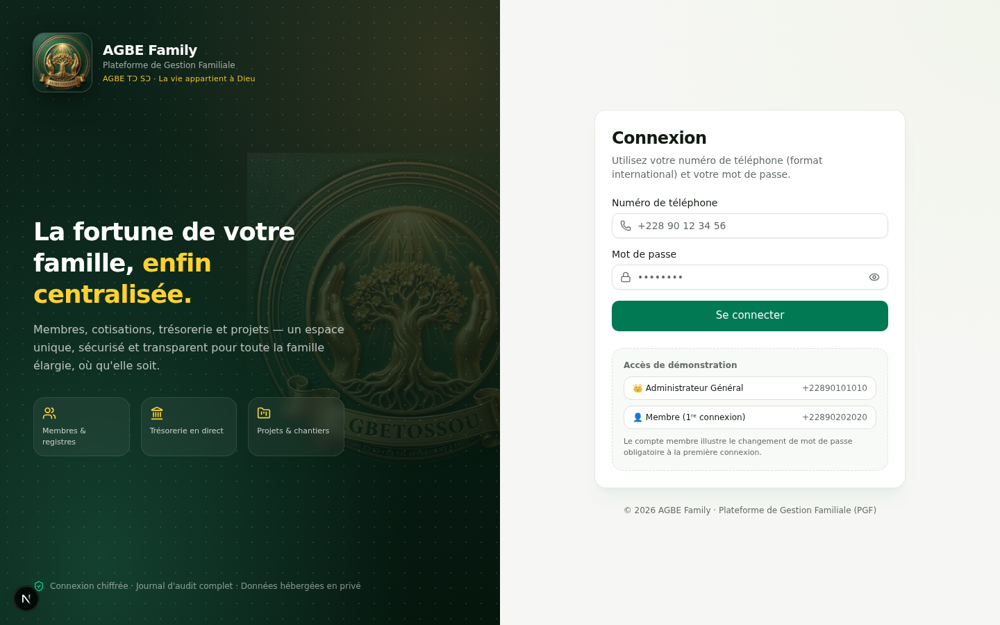
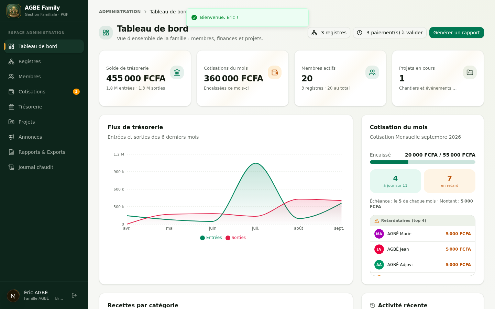
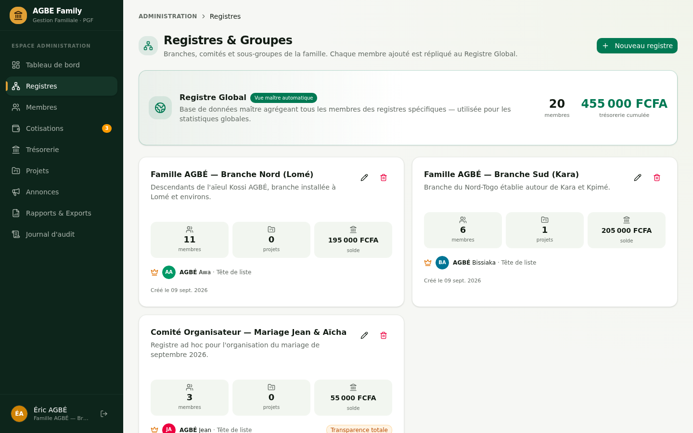
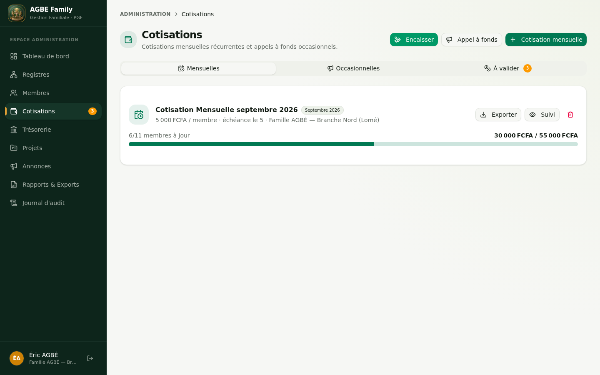
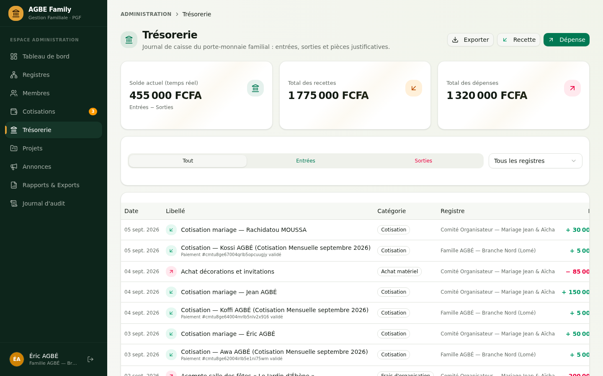
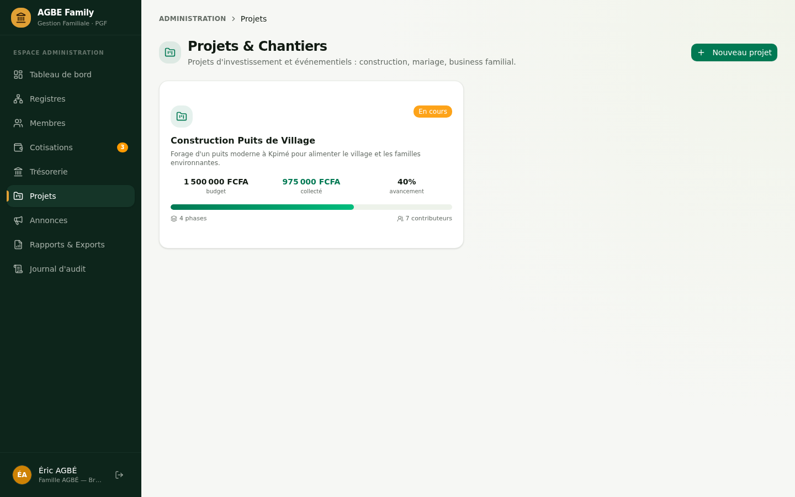
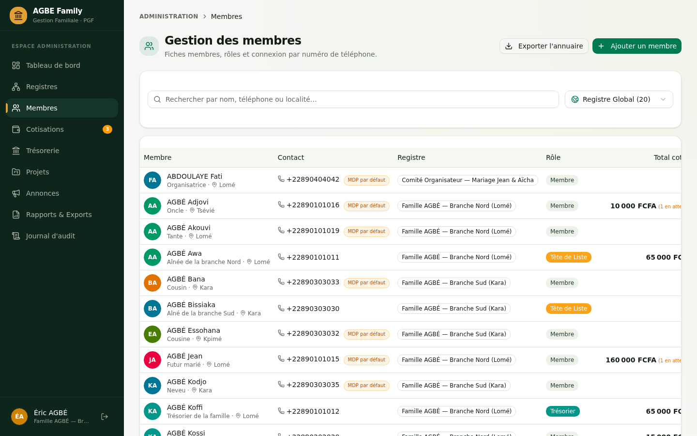
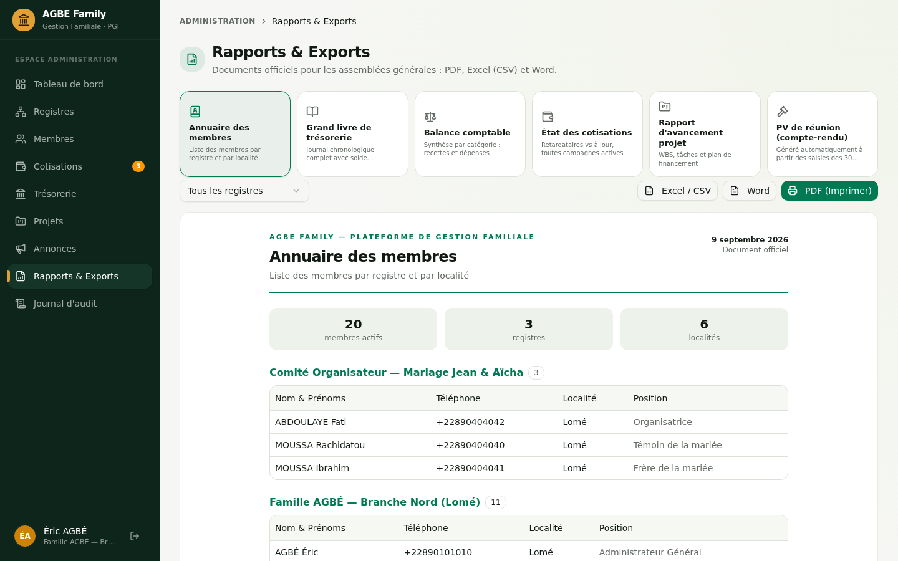
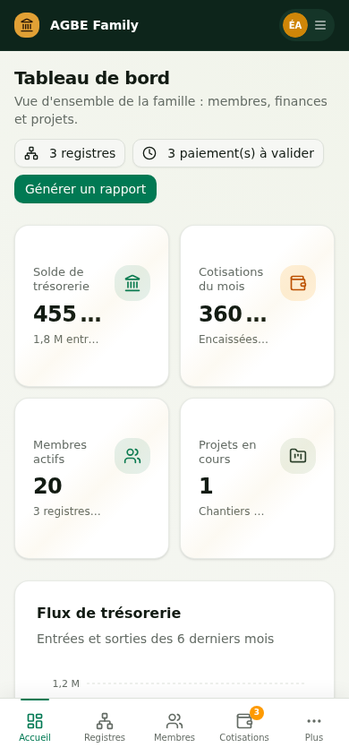
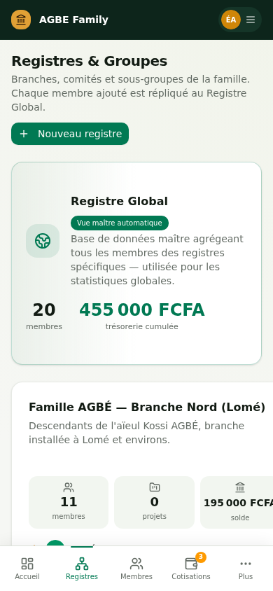

# AGEB Family — Plateforme de Gestion Familiale (PGF)

<div align="center">

**La fortune de votre famille, enfin centralisée.**

Application web complète de gestion des membres, des finances (cotisations & trésorerie)
et des projets collaboratifs des familles élargies, associations de village et clans.

Réalisé conformément au **Cahier des Charges PGF v1.0**.

</div>

---

## 🎯 Fonctionnalités (couverture du cahier des charges)

### 1. Architecture des données & gestion des membres
- ✅ **Registres (groupes)** : branches familiales, comités ad hoc (mariage, urgence…)
- ✅ **Tête de liste** : administrateur désigné par registre, validation des membres
- ✅ **Registre Global automatique** : vue maître agrégée — tout membre ajouté à un
  registre spécifique y est répliqué automatiquement (base des statistiques globales)
- ✅ **Fiche membre** : identité, contact (téléphone unique, localité), position familiale

### 2. Authentification & sécurité
- ✅ Identifiant = **numéro de téléphone (format international)**
- ✅ Mot de passe par défaut (`Famille2026!`) **modifiable obligatoirement à la 1ʳᵉ connexion**
- ✅ Mots de passe hachés (scrypt + sel unique), sessions httpOnly (7 jours)
- ✅ **Journal d'audit** : qui a modifié quoi et quand (traçabilité financière)

### 3. Module financier — Cotisations
- ✅ **Cotisation mensuelle récurrente** : montant fixe + date butoire (ex : le 5)
- ✅ Tableau de bord mensuel : **qui a payé / qui est en retard**
- ✅ **Encaissement direct par l'admin** : saisie d'une cotisation reçue en main
  propre (espèces / Mobile Money) → paiement validé + trésorerie créditée
  immédiatement, avec suggestion du reste dû et raccourci par membre dans le suivi
- ✅ **Preuve de paiement** : photo/ capture Mobile Money téléversée par le membre
- ✅ Validation par le trésorier → **trésorerie créditée automatiquement**
- ✅ **Cotisation occasionnelle (appel à fonds)** avec objectif global
- ✅ **Cotisations nommées** : modèles d'événements — Funérailles, Mariage, Baptême,
  Naissance, Maladie/Accident, Études — qui pré-remplissent l'intitulé
  (ex : « Cotisation pour les funérailles de Papa X »)
- ✅ **Bénéficiaire rattaché** : autocomplétion des membres qui complète l'intitulé
  (« de AGBÉ Kossi ») et rattache l'aide au membre (badge sur la carte, ligne dans le suivi)
- ✅ **Doublons bloqués** : avertissement temps réel dans le formulaire + garde-fou serveur
  (intitulés normalisés : casse et accents ignorés)
- ✅ **Annonce auto au lancement** : publie dans le fil d'annonces (objectif, participation,
  clôture) en même temps que la campagne — même transaction
- ✅ **Icônes d'événement** sur les cartes, le suivi et le sélecteur d'encaissement +
  badge « À clôturer » quand l'échéance est dépassée
- ✅ **Option A** : montant unique — **Option B** : montants personnalisés par paliers
  (l'admin coche les membres et leur dû : « les oncles 50 000, les cousins 10 000 »)
- ✅ Barre de progression de l'objectif

### 4. Module comptabilité — Trésorerie
- ✅ **Journal de caisse** : entrées (cotisations, dons, ventes) / sorties (achats,
  frais d'organisation, aides sociales)
- ✅ Champs obligatoires : date, libellé, catégorie, montant
- ✅ **Pièces justificatives** (factures / reçus) téléversées
- ✅ **Solde temps réel** (Entrées − Sorties) + filtres par registre/type/période

### 5. Module gestion de projets
- ✅ **Fiche projet** : description, dates, budget total requis
- ✅ **Découpage WBS** : phases avec avancement en pourcentage
- ✅ **« Qui fait quoi »** : assignation de tâches aux membres (suivi par le membre lui-même)
- ✅ **« Qui paie quoi »** : apports spécifiques (numéraire / en nature) avec tableau
  de répartition des coûts par membre — les apports numéraires alimentent la trésorerie

### 6. Reporting & exports (assemblées générales)
- ✅ **Annuaire** : membres par registre / localité
- ✅ **Grand livre** chronologique avec solde progressif
- ✅ **Balance** par catégorie
- ✅ **État des cotisations** : retardataires vs à jour
- ✅ **Rapport d'avancement projet** + plan de financement
- ✅ **PV de réunion généré automatiquement** à partir des saisies des 30 derniers jours
- ✅ Formats : **PDF** (impression optimisée), **Excel/CSV**, **Word**

### 7. Interfaces & rôles
- ✅ **Espace Administrateur** (Tête de liste / Trésorier / Admin général) : CRUD total,
  validation des paiements, configuration des cotisations, gestion des projets
- ✅ **Espace Membre** : « Ma situation financière » (total cotisé, reste à payer),
  « Mes projets » (avancement), historique de paiements et reçus, annonces
- ✅ **Confidentialité** : un membre ne voit pas les finances des autres membres,
  sauf mode « **Transparence Totale** » activé par registre

### 8. Technique
- ✅ **Application Web Responsive** (mobile-first) + **PWA installable** (manifest)
- ✅ Journal d'audit complet, sessions sécurisées

---

## 🛠️ Stack technique

| Couche | Technologie |
|---|---|
| Framework | **Next.js 16** (App Router, TypeScript 5) |
| UI | **Tailwind CSS 4** + shadcn/ui (style New York) + Lucide |
| Graphiques | Recharts |
| Base de données | **SQLite** via **Prisma ORM** |
| Notifications | Sonner (toasts) |
| Auth | Sessions httpOnly + scrypt (Node crypto) |

## 🎨 Identité visuelle

Palette **« Bleu Nuit & Or »** (emblème officiel Agbetossou) : prestige, unité,
héritage — barre latérale « nuit profonde » (#161C2B), or champagne (#BB9961)
pour les accents, boutons primaires bleu nuit profond, typographie Geist.
Thème clair, UI bilingue FR.

Emblème **AGBETOSSOU** (logo officiel) : écusson circulaire — monogramme **AG**
entrelacé (A or, G bleu nuit) encerclé d'une couronne de laurier bicolore,
cœur familial formé de deux silhouettes, devise « **UNITÉ · AMOUR · RESPECT ·
HÉRITAGE** ». Décliné en favicon, icônes PWA (manifest, theme bleu nuit #171B29)
et écrans d'authentification (filigrane rond transparent).

## 📸 Aperçu de l'application

**Connexion & Tableau de bord administrateur**

| Connexion — split-screen « forêt & or » | Tableau de bord — KPIs, flux de trésorerie |
|:---:|:---:|
|  |  |

**Modules clés**

| Registres & Groupes | Cotisations & validation des paiements |
|:---:|:---:|
|  |  |

| Trésorerie — journal de caisse | Projets — WBS, tâches & apports |
|:---:|:---:|
|  |  |

| Membres — annuaire | Rapports & Exports imprimables |
|:---:|:---:|
|  |  |

**Mobile-first (390 px)**

| Tableau de bord mobile | Registres mobile |
|:---:|:---:|
|  |  |

---

## 🚀 Installation

```bash
# 1. Dépendances
bun install        # ou npm install

# 2. Base de données
cp .env.example .env   # puis ajustez DATABASE_URL si besoin
bun run db:push        # crée le schéma SQLite
bun run db:generate    # génère le client Prisma

# 3. Données de démonstration (Famille AGBÉ — recommandé)
bun run scripts/seed.ts

# 4. Démarrage
bun run dev           # http://localhost:3000
```

## 👤 Comptes de démonstration

> Ces identifiants ne sont **plus affichés sur la page de connexion** :
> la saisie est manuelle. Le détail des rôles et des parcours de test
> figure dans le **Guide d'utilisation** (`docs/AGBE-Guide-Utilisation.pdf`, chapitre 03).

| Rôle | Téléphone | Mot de passe |
|---|---|---|
| 👑 Administrateur Général | `+22890101010` | `Admin@2026` |
| 🗝️ Tête de Liste (Branche Nord) | `+22890101011` | `Tete@2026` |
| 💰 Trésorier | `+22890101012` | `Tresor@2026` |
| 🗝️ Tête de Liste (Branche Sud) | `+22890303030` | `Nord@2026` |
| 👤 Membre (démontre la 1ʳᵉ connexion) | `+22890202020` | `Famille2026!` |

> Le compte « Membre » illustre le **changement de mot de passe obligatoire**
> à la première connexion (spécification § 2.2 du cahier des charges).
> Après un test, réinitialisez-le avec `bunx tsx scripts/reset_demo_member.ts`.

## 📦 Mise en production (déploiement)

L'infrastructure de production est prête dans le dépôt :

| Fichier | Rôle |
|---|---|
| `Dockerfile` | Image Docker multi-étapes (build bun → runtime node, standalone) |
| `docker-compose.yml` | Application + conteneur de sauvegardes automatiques |
| `docker/entrypoint.sh` | Initialisation de la base + amorçage du compte admin |
| `deploy/nginx.conf` | Reverse proxy HTTPS (Let's Encrypt, gzip, cache, rate-limit) |
| `docs/DEPLOIEMENT.md` | **Guide d'installation pas-à-pas** (VPS + Docker + Nginx) |

Deux documents PDF accompagnent la mise en service :
- `docs/AGBE-Guide-Utilisation.pdf` — guide complet pour les utilisateurs et testeurs
  (connexion, comptes de démonstration, rôles, chaque module, FAQ) ;
- `docs/AGBE-Plan-Deploiement.pdf` — plan d'infrastructure : comparatif de trois
  niveaux d'hébergement (VPS économique / VPS performance / cloud managé),
  dimensionnement, sécurité et feuille de route de scalabilité.

Démarrage rapide sur un VPS : `docker compose up -d --build` (cf. `docs/DEPLOIEMENT.md`).

## 📁 Structure du projet

```
├── prisma/schema.prisma          # Modèle de données (13 modèles)
├── scripts/seed.ts               # Données de démonstration
├── scripts/bootstrap-admin.mjs   # Amorçage du compte admin (production)
├── scripts/reset_demo_member.ts  # Réinitialisation du compte membre démo
├── Dockerfile                    # Image Docker de production
├── docker-compose.yml            # Orchestration + sauvegardes
├── docker/entrypoint.sh          # Point d'entrée du conteneur
├── deploy/nginx.conf             # Reverse proxy HTTPS
├── docs/                         # Guide d'utilisation + plan de déploiement (PDF)
├── src/
│   ├── app/
│   │   ├── page.tsx              # SPA (auth + espaces admin/membre)
│   │   ├── layout.tsx            # Métadonnées + PWA
│   │   └── api/                  # 20+ routes REST (auth, membres, cotisations…)
│   ├── lib/
│   │   ├── auth.ts               # scrypt + sessions
│   │   ├── audit.ts              # journal d'audit
│   │   ├── constants.ts          # énumérations métier
│   │   └── format.ts             # formatage FCFA / dates FR
│   └── components/pgf/
│       ├── login-screen.tsx      # écran de connexion premium
│       ├── app-shell.tsx         # coque (sidebar + nav mobile)
│       ├── admin/                # 9 vues administrateur
│       ├── member/               # 4 vues espace membre
│       └── shared/               # composants partagés
└── public/manifest.json          # PWA
```

## 🔒 Sécurité

- Mots de passe jamais stockés en clair (scrypt, sel par utilisateur)
- Sessions par jeton httpOnly + expiration automatique
- Validation des rôles à chaque requête API (admin / membre)
- Contrôle de confidentialité financière par registre
- Assainissement des noms de fichiers téléversés (anti-traversée)
- Journal d'audit inaltérable pour toute action sensible

---

## 📖 User Story de démonstration (§ 9 du cahier des charges)

1. Connectez-vous en **Administrateur** → créez/modifiez des registres
2. Ajoutez des membres → ils apparaissent dans le **Registre Global**
3. Consultez la **Cotisation Mensuelle septembre** (5 000 FCFA, échéance le 5)
4. Connectez-vous en **Membre** → payez et joignez la capture Mobile Money
5. En admin : **validez le paiement** → la trésorerie est créditée, le solde du membre passe à 0
6. Explorez le projet **« Construction Puits de Village »** (WBS, tâches, apports)
7. Générez le **PV de réunion** et exportez-le en PDF / Word / Excel

---

© 2026 AGBE Family — Plateforme de Gestion Familiale (PGF)
